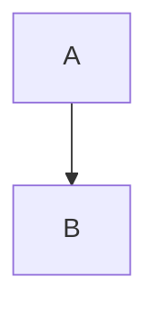

# Elixir Design Patterns
[](https://semaphoreci.com/fulnir/elixir_design_pattern) [](https://codecov.io/bb/fulnir/elixir_design_pattern) [](https://ebertapp.io/github/Fulnir/Elixir_Design_Pattern) [](LICENSE.txt)

## Builder

See [(https://en.wikipedia.org/wiki/Builder_pattern)](https://en.wikipedia.org/wiki/Builder_pattern)

The simplest way to build a struct.

```elixir
car = Car.new("Blues Mobil")
# Or full struct
car = %Car{name: "Blue Ocean", color: :blue, color_doors: :cyan}
```

With a builder
```elixir
CarBuilder.build()
    |> name("Blues Mobil")
    |> color_doors(:black)
```

Or with the Director
```elixir
car = CarDirector.construct("Blues Mobil")
```


# 🚧

Test mermaid in github!

